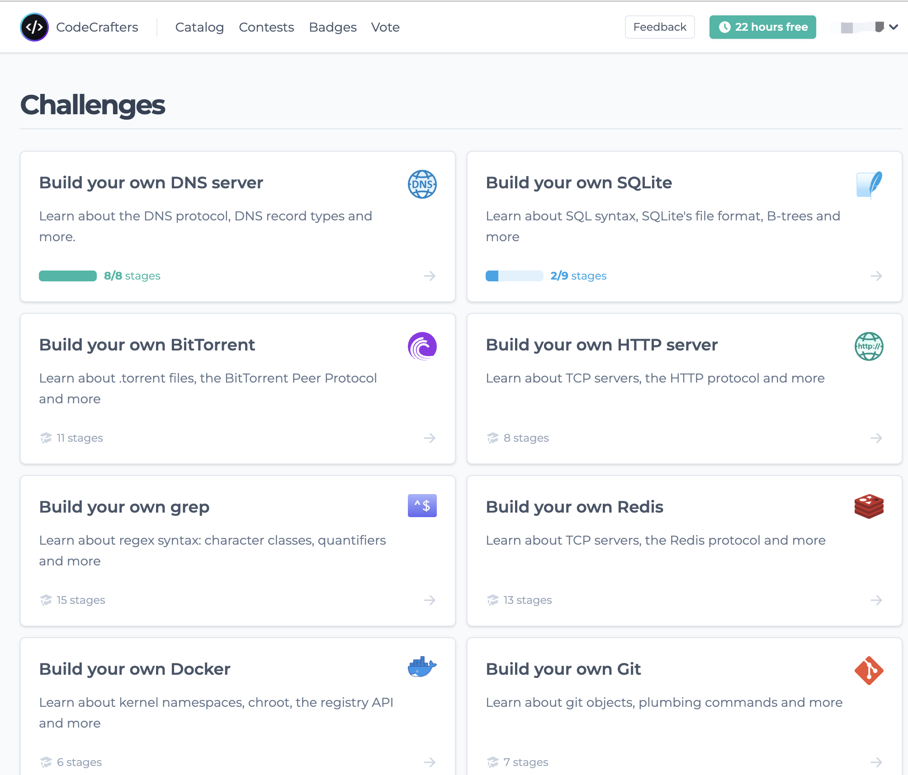

最近发现了一个很酷的网站https://app.codecrafters.io/catalog，可以让你用多种语言来构建一些已有的知名项目，比如redis、git、docker等等，每个挑战都是阶段式的，通过了当前阶段才可以写下个阶段的代码。


我完成了他们的DNS服务器构建的项目，感觉内容还是比较浅尝辄止的，因此打算在他们的多阶段基础上补充整理一下，做成一个五天写一个DNS服务器的系列。每天的代码量不会超过100行，不使用任何第三方crate，并且都有对应的测试可以验证。在5天后，我们将拥有一个可以和真实服务器对话的DNS服务器。Here we go！

## DNS协议介绍

关于DNS的概念和大致的工作原理，本文假设读者都已经了解，不再进行赘述。我们直接来看DNS协议的组成部分。通常，DNS通过UDP协议工作，并且每条消息不会超过512字节。DNS的请求和响应是同一格式的，这使得我们只要写出一个DNS结构，而不需要像HTTP协议那样区分request和response。一个DNS的消息由以下几个部分组成：

| 名称         | 大小   | 结构            | 描述                 |
|------------|------|---------------|--------------------|
| Header     | 12字节 | Header类型      | 消息头                |
| Question   |      | Question类型的数组 | 通常只有一条，表明要查询的域名和类型 |
| Answer     |      | Record类型的数组   | 对问题的答案             |
| Authority  |      | Record类型的数组   | 用于解析递归查询的record    |
| Additional |      | Record类型的数组   | 其他的record          |

DNS的消息主要由三种数据结构组成：Header，Question和Record，我们依次来实现这些结构。

# 结构体定义

本节为了代码展示的简便，省略了一些细节，如`#[allow(unused)]`、`#[derive(Debug, Clone)]`等，大家如果想自己写的话看着加上就好。

## Header
首先来看Header类型，它包含了这条DNS消息的一些基本信息。**一个Header结构永远是12个字节大小。**

| RFC名字 | 解释     | 长度             | 描述                                                                                                                                                                         |
| -------- | -------------------- | ------------------ | ----------------------------------------------------------------------------------------------------------------------------------------------------------------------------------- |
| ID       | Packet Identifier    | 16 bits            | 请求会随机生成一个ID，对该请求的响应必须返回同样的ID。这是为了在无状态的UDP协议中区分不同的响应。       |
| QR       | Query Response       | 1 bit              | 0代表请求，1代表响应                                                                                                     |
| OPCODE   | Operation Code       | 4 bits             | 通常都是0，具体参考RFC1035                                                               |
| AA       | Authoritative Answer | 1 bit              | 如果是1，说明返回响应的那个服务器是authoritative的，也就是它“拥有”被查询的域名                                                                                |
| TC       | Truncated Message    | 1 bit              | 如果是1，则消息超过512字节。通常这意味着DNS是通过TCP协议通信的，此时长度限制不再有效   |
| RD       | Recursion Desired    | 1 bit              | 若由请求的发送方设置为1，则说明服务器应当在查询不到域名的情况下尝试递归查询                     |
| RA       | Recursion Available  | 1 bit              | 是否支持递归查询                                                       |
| Z        | Reserved             | 3 bits             | 一开始是保留字段，现在被用于DNSSEC查询                                                                                                                 |
| RCODE    | Response Code        | 4 bits             | 响应状态 |
| QDCOUNT  | Question Count       | 16 bits            | Question的数量                                                                                 |
| ANCOUNT  | Answer Count         | 16 bits            | Answer的数量                                                                                      |
| NSCOUNT  | Authority Count      | 16 bits            | Authority Section的数量                                                                                                                                      |
| ARCOUNT  | Additional Count     | 16 bits            | Additional Section的数量

直接写出DNSHeader的定义：

```rust
pub struct DNSHeader {
    pub ID: u16,
    pub QR: u8,
    pub OPCODE: u8,
    pub AA: u8,
    pub TC: u8,
    pub RD: u8,
    pub RA: u8,
    pub Z: u8,
    pub RCODE: u8,
    pub QDCOUNT: u16,
    pub ANCOUNT: u16,
    pub NSCOUNT: u16,
    pub ARCOUNT: u16,
}
```

对于小于8bit的数据，为了方便也使用了u8。这里为了和RFC的名字保持一致而使用了大写的成员名，这和Rust的风格是不符的，别忘了加上`#[allow(non_snake_case)]`让编译器别乱报警告。

要将其表示为12个字节的array，我们需要一个serialize方法，它返回一个`[u8; 12]`，前两个字节直接由header的ID组成，第三个字节有8位，可以由1(QR)+4(OPCODE)+1(AA)+1(TC)+1(RD)组成，考虑到我们用u8来存储这些值，需要做相应的位移处理：
- QR左移7位，占据左边的1个bit
- OPCODE左移3位，占据第2到5个bit
- AA左移2位
- TC左移1位
- RD不用左移

第4个字节有8位，由1(RA)+3(Z)+4(RCODE)组成，位移处理为：
- RA左移7位，占据左边第1个bit
- Z左移4位，占据第2到4个bit
- RCODE不用位移

剩下的就直接数字转u8数组即可。

```rust
impl DNSHeader {
    pub fn serialize(&self) -> [u8; 12] {
        let mut header = [0; 12];
        &mut header[0..2].copy_from_slice(&self.ID.to_be_bytes());
        header[2] = self.QR << 7 | self.OPCODE << 3 | self.AA << 2 | self.TC << 1 | self.RD;
        header[3] = self.RA << 7 | self.Z << 6 | self.RCODE;
        &mut header[4..6].copy_from_slice(&self.QDCOUNT.to_be_bytes());
        &mut header[6..8].copy_from_slice(&self.ANCOUNT.to_be_bytes());
        &mut header[8..10].copy_from_slice(&self.NSCOUNT.to_be_bytes());
        &mut header[10..12].copy_from_slice(&self.ARCOUNT.to_be_bytes());

        header
    }
}
```

给DNSHeader加上`#[derive(Debug)]`，就可以打印出结构体的值了。

## Question

Question代表你想要查询的域名，其结构如下：

| 成员  | 类型           | 描述                                                          |
| ------ | -------------- | -------------------------------------------------------------------- |
| Name   | Label Sequence | 域名，被编码成一系列的label |
| Type   | 16位整数 |                                                      |
| Class  | 16位整数 | 实践中几乎永远都是1，参考[RFC](https://www.rfc-editor.org/rfc/rfc1035#section-3.2.4)                              |

这其中主要要注意的是域名的编码规则，域名都是由`.`分隔的，分隔出的叫做label，例如`www.google.com`就包括3个label，分别是`www`, `google`和`com`。label的编码方式是`<length><label>`，即先用一个字节表明接下来的label的长度，再跟上文本；最后以一个`\0x00`结尾，表明这个label sequence的结束。那么`www.google.com`的编码方式就是`\0x03www\x06google\x03com\x00`，或者用十六进制表示为`03 77 77 77 06 67 6f 6f 67 6c 65 03 63 6f 6d 00`

至于type，我们暂时只考虑A类型的type，它的16位整数值是1。

由此，我们定义一个DNSQuestion类型：

```rust
pub struct DNSQuestion {
    pub name: String,
    pub qtype: DNSType,
    pub class: u16,
}
```

name是一个String，直接存域名；qtype（为了避免和关键字type重名）是一个枚举类型，目前仅实现了A：

```rust
pub enum DNSType {
    A, // 1
    UNKNOWN(u16),
}
```

实现一下qtype和数字之间的转换：

```rust
impl DNSType {
    pub fn to_num(&self) -> u16 {
        match *self {
            Self::A => 1,
            Self::UNKNOWN(n) => n,
        }
    }

    pub fn from_num(num: u16) -> Self {
        match num {
            1 => Self::A,
            n => Self::UNKNOWN(n),
        }
    }
}
```

和Header一样，Question也需要一个序列化的函数serialize，主要考虑的就是域名的序列化。根据上面的规则不难写出序列化的逻辑：
若域名为空，直接返回一个0；否则按`.`进行split，拆成的每一个part进行一个map，map成它的程度再加上它本身，组成一个u8的vec，此时得到的是一个`Vec<u8>`的iterator，将其flatten并collect，得到一个u8向量，最后在结尾加上一个0即可。

```rust
fn encode_domain(domain: String) -> Vec<u8> {
    if domain.is_empty() {
        return vec![0];
    }
    let mut encoded: Vec<u8> = domain
        .split('.')
        .map(|part| {
            let mut v = vec![part.len() as u8];
            v.extend_from_slice(part.as_bytes());
            v
        })
        .flatten()
        .collect();
    encoded.push(0);
    encoded
}
```

那么Question的serialize函数就很容易写了：

```rust
impl DNSQuestion {
    pub fn serialize(&self) -> Vec<u8> {
        let mut v = encode_domain(self.name.clone());
        v.extend_from_slice(self.qtype.to_num().to_be_bytes().as_slice());
        v.extend_from_slice(self.class.to_be_bytes().as_slice());
        v
    }
}
```

## Record

DNS消息体剩下来的3个成员：Answer，Authority Section和Additional Section，都是同样的Record列表类型。一个Record的结构如下：

| 成员  | 类型           | 描述                                                                       |
| ------ | -------------- | --------------------------------------------------------------------------------- |
| Name   | Label Sequence | 域名，被编码成一系列的label              |
| Type   | 2-byte Integer |                                                                   |
| Class  | 2-byte Integer | 实践中基本永远是1                                           |
| TTL    | 4-byte Integer | 一条记录还可以存活的时间 |
| Len    | 2-byte Integer | 数据长度                                          |
| Data   | Len-byte data  | 实际数据，长度是Len |

```rust
pub struct DNSRecord {
    pub name: String,
    pub rtype: DNSType,
    pub class: u16,
    pub ttl: u32,
    pub length: u16,
    pub data: Vec<u8>,
}
```

这部分没什么好讲的了，直接上serialize函数：

```rust
impl DNSRecord {
    pub fn serialize(&self) -> Vec<u8> {
        let mut v = encode_domain(self.name.clone());
        v.extend_from_slice(self.rtype.to_num().to_be_bytes().as_slice());
        v.extend_from_slice(self.class.to_be_bytes().as_slice());
        v.extend_from_slice(self.ttl.to_be_bytes().as_slice());
        v.extend_from_slice(self.length.to_be_bytes().as_slice());
        v.extend_from_slice(self.data.as_slice());
        v
    }
}
```

## DNS消息体定义

完成了上面三个结构的定义，DNS消息本体的定义也水到渠成了：

```rust
pub struct DNS {
    pub header: DNSHeader,
    pub question: Vec<DNSQuestion>,
    pub answer: Vec<DNSRecord>,
    pub authority: Vec<DNSRecord>,
    pub additional: Vec<DNSRecord>,
}
```

而DNS的序列化也就是把所有成员的序列化拼起来，考虑到question和record都是以vec的形式出现的，每个成员serialize以后是一个`Vec<Vec<u8>>`，再flatten整个向量，过程比较繁琐，因而可以单独抽出一个serialize_vec的方法：

```rust
fn serialize_vec(data: &Vec<impl Serialize>) -> Vec<u8> {
    data.iter().map(|e| e.serialize()).flatten().collect()
}
```

这里的Serialize是新定义的一个trait，就是把上面实现了serialize的诸多结构给抽象出了一个共同方法而已：
```rust
pub trait Serialize {
    fn serialize(&self) -> Vec<u8>;
}
```

前面的一些语法细节也应当做相应修改，这里不再赘述，给出最后DNS的序列化方法：

```rust
impl Serialize for DNS {
    fn serialize(&self) -> Vec<u8> {
        vec![
            self.header.serialize().as_slice(),
            serialize_vec(&self.question).as_slice(),
            serialize_vec(&self.answer).as_slice(),
            serialize_vec(&self.authority).as_slice(),
            serialize_vec(&self.additional).as_slice(),
        ]
        .concat()
    }
}
```

无非就是把各个成员都序列化以后拼起来

# 测试

构造一条DNS消息，根据规则写出它的字节表示，然后比较我们的serialize方法是否正确即可。这里我已经帮大伙把字节表示写好了：

```rust
#[test]
fn test_serialize() {
    let dns = DNS {
        header: DNSHeader {
            ID: 3702,
            QR: 0,
            OPCODE: 0,
            AA: 0,
            TC: 0,
            RD: 1,
            RA: 0,
            Z: 0,
            RCODE: 0,
            QDCOUNT: 1,
            ANCOUNT: 1,
            ARCOUNT: 0,
            NSCOUNT: 0,
        },
        question: vec![DNSQuestion {
            name: "www.google.com".to_string(),
            qtype: DNSType::A,
            class: 1,
        }],
        answer: vec![DNSRecord {
            name: "www.google.com".to_string(),
            rtype: DNSType::A,
            class: 1,
            ttl: 64,
            length: 4,
            data: vec![8, 8, 8, 8],
        }],
        authority: vec![],
        additional: vec![],
    };

    let bytes = [
        14, 118, 1, 0, 0, 1, 0, 1, 0, 0, 0, 0, 3, 0x77, 0x77, 0x77, 6, 0x67, 0x6f, 0x6f, 0x67,
        0x6c, 0x65, 3, 0x63, 0x6f, 0x6d, 0, 0, 1, 0, 1, 3, 0x77, 0x77, 0x77, 6, 0x67, 0x6f,
        0x6f, 0x67, 0x6c, 0x65, 3, 0x63, 0x6f, 0x6d, 0, 0, 1, 0, 1, 0, 0, 0, 64, 0, 4, 8, 8, 8,8,
    ];
    assert_eq!(dns.serialize(), &bytes);
}
```

# 总结
第一天的内容稍微多一点，主要是要介绍DNS的组成部分。下一章我们将实现DNS的反序列化，从字节里构造DNS对象