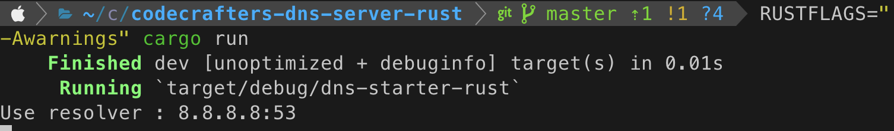
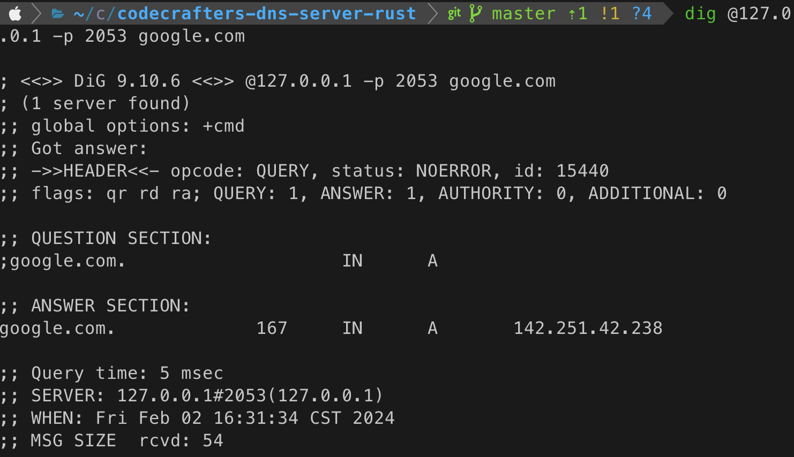

终于，终于，做了如此多的准备，我们可以实现我们的服务器了。DNS通常都走udp协议，我们定义一个UdpSocket，绑定本地的2053端口；为了转发请求，我们定义一个resolver，转发给google的公开dns

```rust
fn main() {
    let udp_socket = UdpSocket::bind("127.0.0.1:2053").expect("Failed to bind to address");

    let resolver = "8.8.8.8:53";
    println!("Use resolver : {resolver}");
}
```

在主循环内，我们定义一个接收请求的buffer，从udpsocket里接收字节流

```rust
fn main() {
    let udp_socket = UdpSocket::bind("127.0.0.1:2053").expect("Failed to bind to address");

    let resolver = "8.8.8.8:53";
    println!("Use resolver : {resolver}");

    loop {
        let mut buf = [0; 512];
        match udp_socket.recv_from(&mut buf) {
            Ok((_, source)) => {
            }
            Err(e) => {
                eprintln!("Error receiving data: {}", e);
                break;
            }
        }
    }
}
```

接收到请求之后，调用之前到解析DNS的代码，获得一个DNS消息体。根据它每一个的question，发送给目标resolver，得到DNS的响应体。解析出响应体的answer，再包装成DNS，发回我们的udpsocket，一次服务就完成了。

```rust
前略
            Ok((_, source)) => {
                let dns = DNS::new(&buf);

                let mut resp_questions = vec![];
                let mut resp_answers = vec![];

                dns.question.iter().for_each(|q| {
                    let forward_dns = /* 构建要发送给resolver的dns */

                    let bind = UdpSocket::bind("0.0.0.0:0").expect("Failed to bind");

                    let mut res_buffer = [0; 512];
                    bind.send_to(forward_dns.serialize().as_slice(), resolver)
                        .expect("Failed to send messages");
                    bind.recv_from(&mut res_buffer)
                        .expect("Failed to get answers");

                    let ans_dns = DNS::new(&res_buffer);
                    resp_questions.push(ans_dns.question[0].clone());
                    resp_answers.push(ans_dns.answer[0].clone());
                });

                let resp_dns = format_response(&dns, resp_questions, resp_answers);

                let response = resp_dns.serialize();
                udp_socket
                    .send_to(&response, source)
                    .expect("Failed to send response");
            }
```

构建dns为了简单，大部分参数抄来源的dns即可，下面的代码比较冗长，不想看的直接跳过即可：

```rust
    let forward_dns = DNS {
        header: DNSHeader {
            ID: dns.header.ID,
            QR: dns.header.QR,
            OPCODE: 0,
            AA: dns.header.AA,
            TC: dns.header.TC,
            RD: dns.header.RD,
            RA: dns.header.RA,
            Z: dns.header.Z,
            RCODE: 0,
            QDCOUNT: 1,
            ANCOUNT: 0,
            NSCOUNT: 0,
            ARCOUNT: 0,
        },
        question: vec![q.clone()],
        answer: vec![],
        additional: vec![],
        authority: vec![],
    };
```

包括下面的format_response，

```rust
fn format_response(req_dns: &DNS, questions: Vec<DNSQuestion>, answers: Vec<DNSRecord>) -> DNS {
    let resp_header = DNSHeader {
        ID: req_dns.header.ID,
        QR: 1,
        OPCODE: req_dns.header.OPCODE,
        AA: req_dns.header.AA,
        TC: req_dns.header.TC,
        RD: req_dns.header.RD,
        RA: req_dns.header.RA,
        Z: req_dns.header.Z,
        RCODE: if req_dns.header.OPCODE == 0 { 0 } else { 4 },
        QDCOUNT: req_dns.question.len() as u16,
        ANCOUNT: req_dns.question.len() as u16,
        NSCOUNT: 0,
        ARCOUNT: 0,
    };

    DNS {
        header: resp_header,
        question: questions,
        answer: answers,
        authority: vec![],
        additional: vec![],
    }
}
```

这部分代码偷了点懒，写死了一些东西，不过对我们的baby server来说也够了。还是来直接测试吧。

开俩terminal，有tmux的话更好。一边`cargo run`，


另一边`dig @127.0.0.1 -p 2053 google.com`，


我们的服务器运行在2053端口，dig去找127.0.0.1的2053，让它查询google.com，返回的answer状态为NOERROR，并且告诉我们google.com的地址是142.251.42.238

至此，我们的第一个dns服务器就正常工作了。

# 总结

今天的内容也是很少，有了之前的铺垫，今天要做的只是收发请求。但是，这个服务器说到底只是一层皮，一切的工作还是8.8.8.8在做，没什么实际意义。明天我们会研究如何进行真正的dns查询，摆脱其他的resolver，自己进行查询。